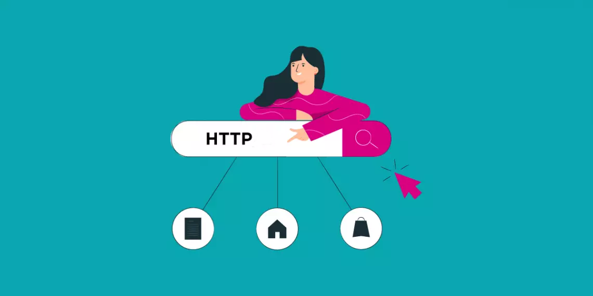

   

# :lock: Protocolo HTTP

> O protocolo HTTP (Hypertext Transfer Protocol) viabiliza a busca de recursos em relação a uma página na internet como documentos HTML. Também transfere dados de hiper-mídia (imagens, sons e textos).

---

# A importância do protocolo HTTP

Nesse amplo fluxo de dados, os clientes e servidores se comunicam trocando mensagens individuais. Determinadas mensagens enviadas pelo cliente, geralmente um navegador da Web, são chamadas de solicitações e as mensagens enviadas pelo servidor como resposta são chamadas de “respostas.

Normalmente, este protocolo utiliza o porta 80 e é usado para a comunicação de "sites" (sítios), comunicando na linguagem HTML (Hipertext Markup Language, ou Linguagem de Marcação de Hipertexto). Contudo, para haver comunicação com o servidor do site é necessário utilizar comandos adequados, que não estão em linguagem HTML.

Exemplos de programas que rodam na porta 80 e conhecem HTTP: NGINX, Apache, Tomcat, Node.

# Funcionamento do protocolo HTTP

Um sistema de comunicação em rede possui diversos protocolos que trabalham em conjunto para o fornecimento de serviços. Para que o protocolo HTTP consiga transferir seus dados pela Web, é necessário que os protocolos TCP e IP (Internet Protocol, Protocolo de Internet) tornem possível a conexão entre clientes e servidores através de sockets TCP/IP.

* **Protocolo IP**: Faz sua informação chegar no servidor.
* **Protocolo TCP**: Diz como deve enviar suas informações e garante a não perca de informações e ordenação.

De acordo com Fielding et al (1999, p. 10), o HTTP utiliza o modelo cliente-servidor, como a maioria dos protocolos de rede, baseando-se no paradigma de requisição e resposta. Um programa requisitante (cliente) estabelece uma conexão com um outro programa receptor (servidor) e envia-lhe uma requisição, contendo a URI, a versão do protocolo, uma mensagem MIME (padrão utilizado para codificar dados em formato de textos ASCII para serem transmitidos pela Internet) contendo os modificadores da requisição, informações sobre o cliente e, possivelmente, o conteúdo no corpo da mensagem.

O servidor responde com uma linha de status (status line) incluindo sua versão de protocolo e um código de operação bem sucedida ou um código de erro, seguido pelas informações do servidor, metainformações da entidade e possível conteúdo no corpo da mensagem. Após o envio da resposta pelo servidor, encerra-se a conexão estabelecida.

# Camadas de rede (versão simplificada)

**Navegador**
* 1. Aplicação: HTTP, SMTP, DACP e FTP.
* 2. Transporte: TCP e UDP.
* 3. Rede: IP.
* 4. Hardaware

FTP (File Tranfer Protocol, ou Protocolo de Transferência de Arquivos), usado para envio de arquivos do computador para um servidor na Web, o SMTP (Simple Mail Transfer Protocol, ou Protocolo de Transferência de Correio Simples), protocolo usado para correio eletrônico (e-mail), entre outros protocolos.

**Internet**

**Servidor**
* 1. Hardware
* 2. Rede
* 3. Transporte
* 4. Aplicação
---

# Request
Uma mensagem de requisição do cliente é composta pelos seguintes campos: uma linha inicial (Request-Line); linhas de cabeçalhos (Request-header); uma linha em branco obrigatória e um corpo de mensagem opcional. A linha inicial de uma requisição é composta por três partes separadas por espaços: o método (Method), a identificação do URI (Request-URI) e a versão do HTTP (HTTP-Version) utilizado.

* **Linha de pedido** =>
Método (GET, POST, PUT, DELETE, PATCH, OPTINS, HEAD, TRACE ou CONNECT)
Recurso
Versão HTTP (HTTP/0.9, HTTP/1.0, HTTP/1.1 e HTTP/2)

--

* **Cabeçalhos gerais** =>
Date
Pragma
Cache-Control
Connection
Trailer
Transfer-Enconding
Upgrade
Via
Warning

--

* **Cabeçalhos de pedido** =>
Preferência de resposta (Accept, Accept-Charset, Accept-Enconding, Accept-Language e TE)
Informações enviada com pedido (Authorization, From, Referer e User-Agent)
Pedido condicional (Proxy-Authorization, IF-Modified-Since, If-Match, If-None-Match, If-Unmodified-Since e If-Range)
Restrição do servidor (Expect, Host, Max-Forwards e Range)

--

* **Cabeçalhos de entidade** =>
Allow
Content-Encoding
Content-Length
Content-Type
Content-Language
Content-Location
Content-MD5
Content-Range
Expires
Last-Modified

**Exemplos de mensagem HTTP**: O protocolo HTTP faz a comunicação entre o cliente e o servidor através de mensagens. O cliente envia uma mensagem de requisição de um recurso e o servidor envia uma mensagem de resposta ao cliente com a solicitação.

_Linha de pedido_
GET/HTTP/1.1
_Cabeçalhos gerais_
Date: Sat, 13 April 2019 23:45:15 GMT
Cache-control: no-cache
Connection: keep-alive
_Cabeçalhos de pedido_
Accept-language: pt-br
Host: http://localhost:3001
User-Agent: Mozilla
Accept: text/html

--
_Linha de pedido_
POST/contato HTTP/1.1
_Cabeçalhos gerais_
Cache-control: no-cache
Connection: keep-alive
_Cabeçalhos de pedido_
Accept-language: pt-br
Host: http://localhost:3001
User-Agent: Mozilla
Accept: application/json
_Cabeçalhos de entidade_
Content-Length: 47
Content-Type: application/x-www-form-urlenc..
_Entidade/Recurso_
nome=Avrton&emai=camillajesuscorreia%...

---
- GET: É o método mais comum: solicita algum recurso como um arquivo ou um script CGI (qualquer dado que estiver identificado pelo URI) por meio do protocolo HTTP. O método GET é reconhecido por todos os servidores.
--
- HEAD: É o mesmo que GET, mas sem que o recurso seja retornado. É usado para obter meta-informações por meio do cabeçalho da resposta, sem ter que recuperar todo o conteúdo.
--
- POST: Envia dados para serem processados (por exemplo, dados de um formulário HTML) para o recurso especificado. Os dados são incluídos no corpo do comando.
--
- PUT: Altera certo recurso.
--
- DELETE: Exclui o recurso.
--
- TRACE: Ecoa o pedido, de maneira que o cliente possa saber o que os servidores intermediários estão mudando em seu pedido.
--
- OPTIONS: Recupera os métodos HTTP que o servidor aceita.
--
- CONNECT: Serve para uso com um proxy que possa se tornar um túnel SSL (um túnel pode ser usado, por exemplo, para criar uma conexão segura).

Um servidor HTTP deve implementar ao menos os métodos GET e HEAD.

---
# Response
Uma mensagem de resposta do servidor é composta pelos seguintes campos: uma linha inicial (Status-Line); linhas de cabeçalhos (Responseheader); uma linha em branco obrigatória e um corpo de mensagem opcional. A linha inicial de uma resposta, chamada de linha de status, possui por sua vez três partes separadas por espaços: a versão do protocolo HTTP (HTTP-Version), um código de status (Status-Code) da resposta, que fornece o resultado da requisição, e uma frase de justificativa (Reason-Phrase) que descreve o código do status.

* **Linha de pedido** =>
Versão HTTP (HTTP/0.9, HTTP/1.0, HTTP/1.1 e HTTP/2)
Número Status (1.X, 2.XX, 3.XX, 4.XX e 5.XX)
Mensagem Status (200 OK, 201 Created, 404  Not Found, etc)

--

* **Cabeçalhos gerais** =>
Date
Pragma
Cache-Control
Connection
Trailer
Transfer-Enconding
Upgrade
Via
Warning

--

* **Cabeçalhos de resposta** =>
Redirecionamento (Location)
Informação (Server, Retry-After e Accepter-Ranges)
Segurança (WWW-Authenticate e Proxy-Authenticate)
Cache (ETag, Age e Vary)

--

* **Cabeçalhos de entidade** =>
Allow
Content-Encoding
Content-Length
Content-Type
Content-Language
Content-Location
Content-MD5
Content-Range
Expires
Last-Modified

**Exemplo**:
_Linha de status_
HTTP/1.1 200 OK
_Cabeçalhos gerais_
Date: Sat, 13 April 2019 23:45:15 GMT
Cache-control: no-cache
Connection: keep-alive
_Cabeçalhos de resposta_
Server: nginx
_Cabeçalhos de entidade_
Content-Type: application/json
_Entidade/Recurso_
{"name":"Ayrton",
"email":"camillajesuscorreia@hotmail.com"}

O Status-Line de uma resposta HTTP indica ao cliente se sua requisição foi bem sucedida ou não (cf. Herrman, 1997, p. 53). Esta situação é fornecida através de um código de retorno (Status-Code) e uma frase explicativa (Reason-Phrase). De acordo com Fielding et al (1999, p. 37), o código de status é formado por três dígitos e o primeiro dígito representa a classe que pertence classificada em cinco tipos:

    * 1xx: Informational (Informação) – utilizada para enviar informações para o cliente de que sua requisição foi recebida e está sendo processada;
    * 2xx: Success (Sucesso) – indica que a requisição do cliente foi bem sucedida;
    * 3xx: Redirection (Redirecionamento) – informa a ação adicional que deve ser tomada para completar a requisição;
    * 4xx: Client Error (Erro no cliente) – avisa que o cliente fez uma requisição que não pode ser atendida;
    * 5xx: Server Error (Erro no servidor) – ocorreu um erro no servidor ao cumprir uma requisição válida.

---
# Vantagens do HTTPS Sobre o HTTP

O *HTTP* usa a porta 80 (ou 8080) e preocupa-se mais em como os dados serão apresentados para o cliente e não com a Segurança dos Dados.

--

O *HTTPS* é, em resumo, um HTTP Seguro que usa a porta 443 ao invés da porta 80.

Cabe destacar que a segurança garantida pelo protocolo TLS é em 3 níveis:

* Confidencialidade: apenas o Cliente e o Servidor podem ler as mensagens.
* Autenticação: o Servidor é quem diz ser.
* Integridade: garante que as mensagens não foram alteradas.

Com o uso de HTTPS as informações são criptografadas o que garante segurança de ponta a ponta.

O Usuário recebe do servidor uma chave pública para criptografar os conteúdos e apenas o servidor tem uma chave privada para descriptografar as mensagens.

   

Feito com 💜 por [Camilla Correia](https://www.linkedin.com/in/camilla-correia-3203a3139/)
